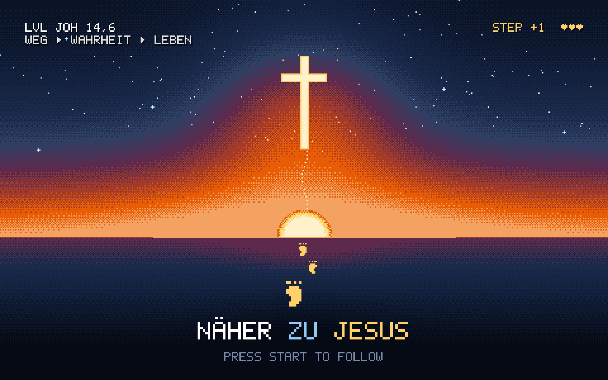

# Näher zu Jesus — Pixel

Ein 8-Bit-Theme für [Omarchy](https://omarchy.org): Sonnenaufgang über dem Nachthimmel, Bernstein-CRT-Terminal, Phosphor-Grün und ein Fensterrahmen im Sonnenaufgangs-Verlauf.

> Kurze Impulse, die dich mindestens einen Schritt näher zu Jesus bringen.
> Für alle, die nicht nur von ihm hören, sondern ihm folgen wollen.

Das Theme basiert auf dem Design des Podcasts **[Näher zu Jesus](https://jesusfirst.adrianenns.de/podcast)**. Reinhören lohnt sich! 🎧



## Installation

```bash
omarchy theme install https://github.com/addisaden/omarchy-naeher-zu-jesus-pixel-theme.git
```

Danach im Menü unter *Style → Theme* auswählen oder:

```bash
omarchy theme set naeher-zu-jesus-pixel
```

## Hintergründe

Mit `omarchy theme bg next` durchschalten:

| Datei | Motiv |
|---|---|
| `1-pixel-sonnenaufgang.png` | Retro-Game-Szene: Kreuz, Sonne, Fußspuren, HUD „LVL JOH 14,6“ |
| `2-boot.png` | BIOS/systemd-Bootlog: `REACHED TARGET NACHFOLGE.TARGET`, „Gnade braucht kein sudo“ (Eph 2,8) |
| `3-hexdump-joh-1-1.png` | `xxd` von Joh 1,1, das Kreuz leuchtet aus den Bytes |
| `4-titelbild-8bit.png` | Das Titelbild des [Podcasts](https://jesusfirst.adrianenns.de/podcast), auf 320×200 gedithert |

Alle Hintergründe sind 3840×2400 (16:10) und haben genug Rand, damit auf 16:9-Monitoren nichts Wichtiges abgeschnitten wird.

## Bildschirmschoner

Fünf Motive im selben Pixel-Stil liegen in `screensaver/`:

| Datei | Motiv |
|---|---|
| `1-kreuz-sonnenaufgang.txt` | Kreuz vor der gestreiften Sonne, Fußspuren, „NÄHER ZU JESUS“ |
| `2-press-start.txt` | Retro-Game: Pilger, Hügel mit Kreuz, HUD, „PRESS START TO FOLLOW“ |
| `3-terminal.txt` | `sudo pacman -S nachfolge` und `REACHED TARGET NACHFOLGE.TARGET` |
| `4-hexdump-joh-1-1.txt` | `xxd` von Joh 1,1, das Kreuz aus den Bytes |
| `5-ich-bin-der-weg.txt` | „ICH BIN DER WEG“ mit Fußspuren, Joh 14,6 |

Omarchys eigener Bildschirmschoner kennt nur eine Datei und würfelt die Effekt-Farben. `bin/omarchy-screensaver` wechselt dagegen durch alle Motive und färbt die Effekte in Sonnenaufgangs-Farben (`screensaver/palette`). Laser, Strahlen und Synthgrid kommen öfter dran, beim Terminal und beim Hexdump auch mal Matrix-Regen in Phosphor-Grün. Jedes Bild bleibt danach fünf Sekunden stehen.

Installieren (einmalig, braucht `sudo`):

```bash
~/.config/omarchy/themes/naeher-zu-jesus-pixel/bin/install-screensaver
omarchy-launch-screensaver force   # Vorschau
```

Das Skript landet in `/usr/local/bin` und wird dort vor Omarchys eigenem gefunden. Mit anderen Themes läuft automatisch wieder der normale Omarchy-Bildschirmschoner. Aus dem Theme liest es nur Textdateien und Hex-Farben. Entfernen mit `install-screensaver --uninstall`.

Ohne Installation geht nur ein einzelnes Motiv mit Omarchys Zufallsfarben:

```bash
cp ~/.config/omarchy/themes/naeher-zu-jesus-pixel/screensaver/1-kreuz-sonnenaufgang.txt ~/.config/omarchy/branding/screensaver.txt
```

## Farben

| Rolle | Farbe |
|---|---|
| Hintergrund | `#0A1020` |
| Text (Bernstein) | `#F7DFA8` |
| Akzent | `#FFD166` |
| Orange | `#FF7A1A` |
| Blau | `#90CAF9` |
| Grün (Phosphor) | `#7CE38B` |
| Rahmen aktiv | `#FFD166 → #E85D04 → #5C2A4D`, 45° |

## Selbst neu rendern

`src/pixel.py` zeichnet die Motive pixelgenau in niedriger Auflösung (eigener 5×7-Bitmap-Font, Bayer-Dithering) und braucht nur Python 3 und ImageMagick:

```bash
python3 src/pixel.py out/
magick out/sunrise.ppm -filter point -resize 800% backgrounds/1-pixel-sonnenaufgang.png
magick out/hex.ppm     -filter point -resize 800% backgrounds/3-hexdump-joh-1-1.png
magick out/boot.ppm    -filter point -resize 400% backgrounds/2-boot.png
magick out/unlock.ppm -transparent '#FF00FF' -filter point -resize 800% unlock.png
cp out/screensaver/*.txt screensaver/
```
